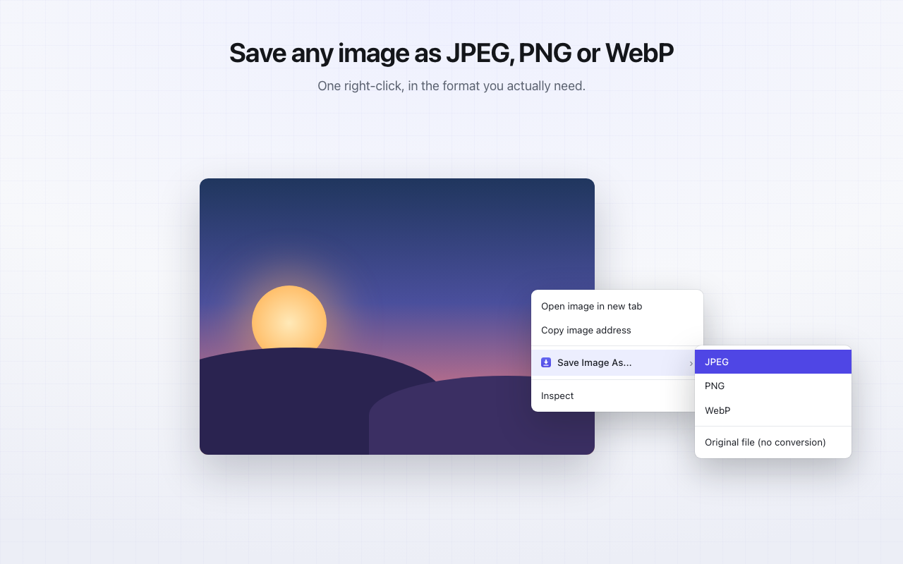
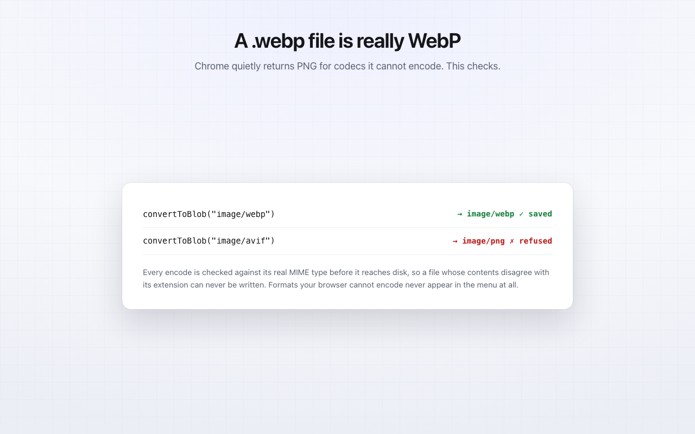
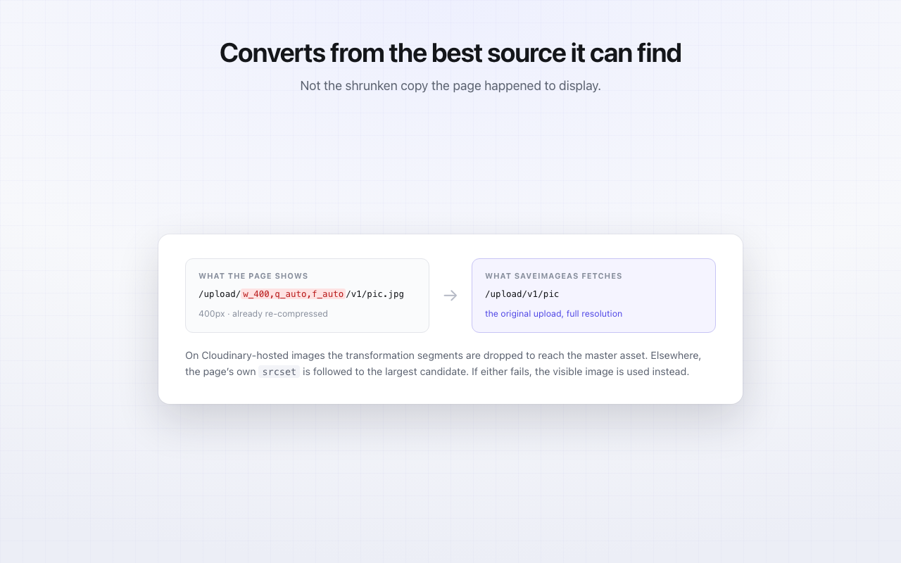
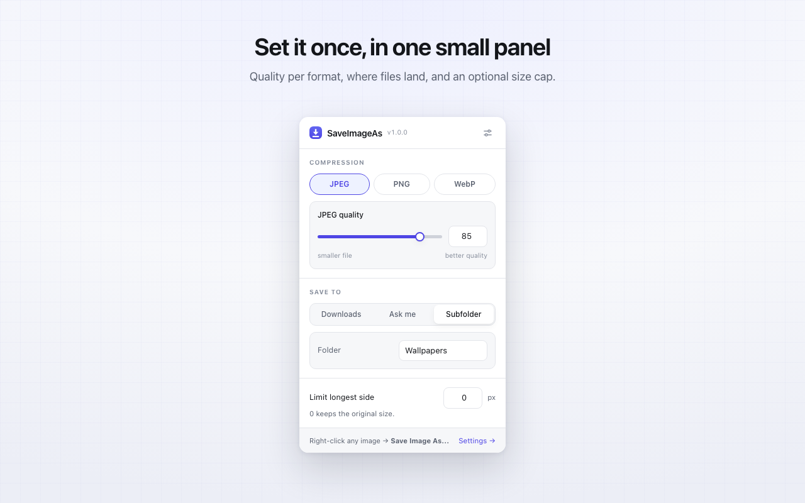

# SaveImageAs

Right-click any image on the web and save it as **JPEG**, **PNG** or **WebP** — or grab the
untouched original. Conversion runs on your machine; nothing is uploaded.



```bash
git clone https://github.com/addyosmani/save-image-as.git
```

Then: `chrome://extensions` → enable **Developer mode** → **Load unpacked** → pick the folder.

---

## Is this really converting, or just renaming the file?

Really converting. The pipeline is `fetch → decode → raster → re-encode`:

```js
const bitmap = await createImageBitmap(blob, { imageOrientation: 'from-image' });
ctx.drawImage(bitmap, 0, 0);
const out = await canvas.convertToBlob({ type: 'image/webp', quality: 0.82 });
```

`convertToBlob` runs Chrome's real libjpeg-turbo / libpng / libwebp encoders. The output is a
genuine file of that format — verified in [`test/harness.js`](test/harness.js) by reading magic
numbers off the resulting bytes rather than trusting `blob.type`.

### The trap this codebase is built around

`canvas.convertToBlob()` **does not throw for a format the browser cannot encode.** It silently
returns `image/png`. Measured on Chrome 148:

| Requested | Returned |
| --- | --- |
| `image/png` | `image/png` |
| `image/jpeg` | `image/jpeg` |
| `image/webp` | `image/webp` |
| `image/avif` | **`image/png`** |
| `image/gif` | **`image/png`** |

So the obvious way to add AVIF support produces a `.avif` file full of PNG bytes, and nothing
fails until someone tries to open it. Two defences:

1. **Probe once at install.** Every format is test-encoded and compared against its real MIME
   type. A format that fails never reaches the context menu. Results are visible under
   *Settings → Encoder support*.
2. **Verify every encode.** [`src/lib/convert.js`](src/lib/convert.js) compares `blob.type`
   against the requested MIME and throws `ENCODER_MISSING` on a mismatch. A file whose contents
   disagree with its extension cannot be written.



AVIF is wired up end to end and will appear on its own the day Chrome ships a canvas AVIF
encoder. Bundling a WASM encoder was considered and rejected: `@jsquash/avif` is a 3.5 MB
binary, which is a lot of weight for a fourth format.

---

## Converting from the best available source

The image on the page is often a downscaled, already-lossy derivative. Converting *that* to PNG
gives you a lossless copy of a thumbnail. So before converting, SaveImageAs looks for something
better.



**`srcset`** — follows the page's own candidate list to the largest entry. The parser treats a
URL as running to the next whitespace, per the HTML spec, so the commas inside a Cloudinary
transformation list are never mistaken for candidate separators.

**Cloudinary** — a delivery URL like

```
https://res.cloudinary.com/demo/image/upload/w_400,q_auto,f_auto/v1699/pic.jpg
```

is a 400px re-encode of a master asset. Dropping the transformation segments *and* the file
extension — which is itself a format request — makes Cloudinary serve the original upload:

```
https://res.cloudinary.com/demo/image/upload/v1699/pic
```

Signed URLs (`s--abc123--`) are left alone, since rewriting invalidates the signature, and
`/image/fetch/` tails are never touched because they contain a whole foreign URL. The original
URL is always kept as a fallback, so a rejected rewrite degrades to exactly the normal
behaviour.

---

## Other things it gets right

**No pointless re-encoding.** Saving a PNG as PNG copies the original bytes verbatim — no
generation loss, metadata intact. Toggleable.

**Correct orientation.** EXIF orientation is honoured explicitly, so phone photos don't come out
sideways.

**No dark halos.** Transparency is flattened onto the configured colour *before* downscaling.
Compositing afterwards pulls the colour of transparent pixels into visible edges.

**Better downscaling.** Steps down by halves rather than one aliased jump.

**Reaches awkward images.** `blob:` URLs exist only inside the page's own origin, and some hosts
serve images only to their own referer. When a direct fetch fails, SaveImageAs asks the page to
fetch the bytes instead.

**SVG.** Rasterised at a useful size derived from its `viewBox`.

---

## Settings



| | |
| --- | --- |
| **Compression** | Per-format quality, applied when converting *into* that format |
| **Passthrough** | Keep original bytes when the source already matches the target |
| **Source upgrade** | Follow `srcset` / request the Cloudinary original |
| **Max dimension** | Cap the longest side; 0 keeps the original size |
| **JPEG background** | Colour that replaces transparency |
| **Filename template** | `{name} {ext} {w} {h} {date} {time} {host}` |
| **Save location** | Downloads, ask each time, or a named subfolder |

Filenames are sanitised per path component — traversal, control characters, bidi overrides and
Windows reserved names are all neutralised — and downloads use `conflictAction: 'uniquify'`, so
nothing is ever overwritten.

---

## Architecture

```
src/background.js        service worker — menus, orchestration, chrome.downloads
src/offscreen.js         messaging seam + object-URL ledger
src/lib/convert.js       the pipeline (zero chrome.* — directly testable)
src/lib/cloudinary.js    source upgrading
src/lib/filename.js      templating + path sanitising
src/lib/settings.js      storage, normalised on read
src/lib/formats.js       format table + encoder probing
```

The service worker never holds image bytes. Conversion runs in an **offscreen document**,
because `URL.createObjectURL` does not exist in an MV3 service worker — the alternative is a
`data:` URL, which base64-inflates the payload by 33% and pins it in memory as a JS string. A
`blob:` URL costs one handle. The offscreen document also brings `HTMLImageElement`, which
decodes SVGs that `createImageBitmap` refuses in a worker. It closes when idle, but never while
a download is still reading from one of its blobs.

`src/lib/convert.js` deliberately touches no `chrome.*` API, so the whole pipeline runs in a
plain page under test.

---

## Development

```bash
node --test test/lib.test.mjs     # 20 assertions: URL rewriting, filenames, settings
```

```bash
python3 -m http.server 8731       # then open /test/harness.html
```

The browser harness is the interesting one: 38 assertions running the real pipeline against real
image bytes — checking magic numbers, pixel values, passthrough byte-equality, resize geometry,
source fallback, and that an unavailable codec is refused rather than mislabelled.
`/test/preview.html?page=popup|options|welcome` renders the extension UI outside Chrome.

```bash
tools/package.sh              # build the Web Store zip (runtime files only)
tools/make-store-assets.sh    # re-render screenshots and promo tiles
tools/make-icons.py           # regenerate icons (pure stdlib, no dependencies)
```

No build step and no runtime dependencies — the source that ships is the source in this repo.

## Permissions

| Permission | Why |
| --- | --- |
| `contextMenus` | The right-click menu |
| `downloads` | Saving the file |
| `storage` | Your settings |
| `offscreen` | The converter document |
| `scripting` | Reading `srcset`; page-side fetch for `blob:` URLs |
| `notifications` | Failure reports |
| `<all_urls>` | Fetching images from whichever site you're on |

No analytics, no telemetry, no remote code, and no network request other than retrieving the
image you clicked. See [PRIVACY.md](PRIVACY.md).

## Licence

[MIT](LICENSE) © Addy Osmani
